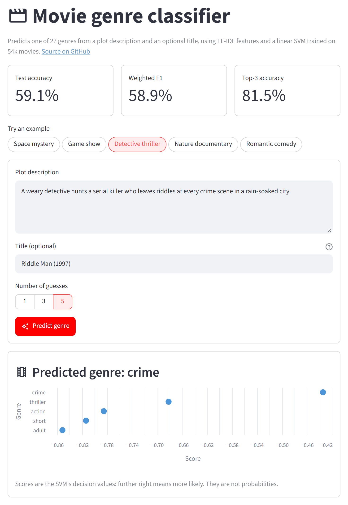

# Movie Genre Classification

[](https://github.com/raviteja311/MOVIE-GENRE-CLASSIFICATION/actions/workflows/tests.yml) [](LICENSE)

Predict a movie's genre (27 classes) from its plot description and title using a scikit-learn pipeline: regex text cleaning, TF-IDF features, and a linear classifier.

<p align="center">
  
</p>
<p align="center"><em>The Streamlit demo (<code>streamlit run streamlit_app.py</code>)</em></p>

## Problem

Given a short plot summary, predict which of 27 genres (drama, comedy, thriller, documentary, ...) the movie belongs to. The classes are very imbalanced: drama and documentary together cover about half of the data, while genres like war and news have fewer than 200 examples each.

## Approach

1. **Data cleaning** (`data.py`): drop training rows whose description also appears in the test set (164), rows with conflicting labels for the same description (11), and exact duplicates (49).
2. **Text cleaning** (`preprocessing.py`): lowercase, strip emails, tags, numbers, punctuation and single letters.
3. **Features** (`model.py`):
   * Description: word unigrams and bigrams, English stopwords removed, `sublinear_tf=True`, `min_df=2`, `max_df=0.9`, capped at 100,000 features.
   * Title: character 2-4 grams (up to 50,000), which pick up the release year and the quoting used for TV episodes.
4. **Models**: Logistic Regression, Complement Naive Bayes and Linear SVC, with balanced class weights where supported. The SVC's `C=0.5` was chosen by 5-fold cross-validation (`movie-genre-tune`).
5. **Selection**: a stratified 80/20 split of the training data. The model with the best **validation** weighted F1 is selected; the labelled test set is only used to report the final score.
6. **Export**: the selected model is refit on all cleaned training data and saved as a single pipeline that accepts raw text. Reported metrics come from the 80% split model; the exported model scores slightly higher (59.43% accuracy, 59.35% weighted F1, 41.30% macro F1).

## Dataset

Three `:::` delimited files live in `data/raw/` (see [data/README.md](data/README.md) for the format):

* `train_data.txt` - 54,214 labelled movies
* `test_data.txt` - 54,200 unlabelled movies
* `test_data_solution.txt` - the same test movies with their `GENRE`, used for held-out evaluation

## Results

Held-out test set (54,200 movies):

* Majority-class baseline: **25.11% accuracy**
* Selected model: **Linear SVC**
* Accuracy: **59.07%**
* Weighted F1: **58.86%**
* Macro F1: **40.74%**
* Top-3 accuracy: **81.45%**

| Model | Val accuracy | Val weighted F1 | Test accuracy | Test weighted F1 | Test macro F1 |
| --- | ---: | ---: | ---: | ---: | ---: |
| Linear SVC | 59.10% | 58.90% | 59.07% | 58.86% | 40.74% |
| Logistic Regression | 54.02% | 55.10% | 53.99% | 55.09% | 39.22% |
| Complement NB | 54.06% | 47.16% | 53.94% | 46.88% | 21.91% |

Without a title the selected model still reaches 58.84% accuracy, 57.43% weighted F1 and 38.16% macro F1 on the test set.

Balanced class weights trade some overall accuracy for better recall on rare genres (higher macro F1).

### Tried and not kept

Each was compared on the validation split:

* **NLTK stopwords and lemmatization** (earlier versions; NLTK is no longer a dependency): no gain over plain regex cleaning and much slower.
* **Title as word tokens**: no gain; character n-grams worked better.
* **Calibrated probabilities** (`CalibratedClassifierCV`): higher accuracy and top-3, but lower weighted and macro F1, because calibration undoes the balanced class weights.

## Project Structure

```
MOVIE-GENRE-CLASSIFICATION/
├── .github/workflows/tests.yml    # CI: pytest on Python 3.12 and 3.14
├── data/
│   ├── README.md                  # file format and source
│   └── raw/                       # train, test and solution files
├── docs/images/                   # README screenshot
├── models/
│   └── movie_genre_classifier.joblib
├── reports/
│   ├── metrics.json               # validation and test metrics, per-class report
│   └── figures/                   # EDA plots and confusion matrix
├── src/movie_genre/
│   ├── config.py                  # paths, constants and tuned C
│   ├── data.py                    # loading, cleaning and splitting
│   ├── preprocessing.py           # text cleaning shared by training and inference
│   ├── model.py                   # pipeline definition and top-k prediction
│   ├── eda.py                     # exploratory analysis
│   ├── tune.py                    # cross-validation for C
│   ├── train.py                   # training, selection, evaluation and export
│   ├── predict.py                 # command-line inference
│   └── download_data.py           # restore the data files
├── tests/                         # pytest suite, including headless app tests
├── streamlit_app.py               # web demo
├── pyproject.toml
├── requirements.txt               # pinned runtime dependencies
└── requirements-dev.txt           # adds pytest
```

## Usage

Create an environment (Python 3.11+) and install the package with pinned dependencies:

```bash
python -m venv .venv
.venv\Scripts\activate          # macOS/Linux: source .venv/bin/activate
pip install -r requirements.txt
```

Explore the data (prints summaries, saves plots to `reports/figures/`):

```bash
movie-genre-eda
```

Tune `C` with cross-validation (about 6 minutes; update `SVC_C` in `config.py` with the result):

```bash
movie-genre-tune
```

Train, evaluate and export the model (about 6 minutes):

```bash
movie-genre-train
```

Predict from the command line. The title is optional but improves accuracy:

```bash
movie-genre-predict "A small-town detective investigates a string of unsettling disappearances." --title "Hollow Creek (2015)" --top-k 3
```

Launch the web demo (opens at http://localhost:8501):

```bash
streamlit run streamlit_app.py
```

The demo takes a plot description and optional title, shows the top 1, 3 or 5 genres with their scores, and includes one-click examples.

Restore the data files from another location:

```bash
movie-genre-download --source-dir <path-to-data>
```

Each command is also available as a module, for example `python -m movie_genre.train`.

## Tests

```bash
pip install -r requirements-dev.txt
pytest                            # 10 tests
```

## License

MIT, see [LICENSE](LICENSE).

## Author

**Jetti Raviteja** · [Portfolio](https://jettiraviteja.vercel.app) · [GitHub](https://github.com/raviteja311) · [LinkedIn](https://www.linkedin.com/in/jettiraviteja/)
